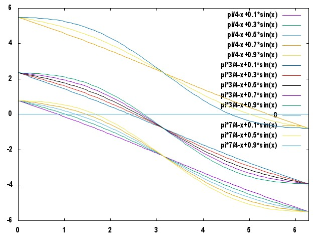

# Two Line Element (TLE)

## 1. What is TLE ?

TLE (Two Line Elements) is a format of parameters called **"orbital elements"**, which are used to calculate orbit of satelites or space debris.

```
1 25544U 98067A   16113.11058294  .00003951  00000-0  66475-4 0  9992",
2 25544  51.6458 337.7423 0001851  63.8623  83.2265 15.54303647996258
```


## 2. How to get TLE ?

We get TLE from Space-Track.org through a REST API. We need an access account to use it.

### 2.1 command line

Get cookie for session.

```
$ curl -c cookies.txt -b cookies.txt -k https://www.space-track.org/ajaxauth/login -d "identity=myusername&password=mypassword"
```

Send query with cookie.

```
$ curl --limit-rate 100K --cookie cookies.txt "https://www.space-track.org/basicspacedata/query/class/tle_latest/ORDINAL/1/NORAD_CAT_ID/123/orderby/TLE_LINE1 ASC/format/tle" > sample.json
```

Response:

```
[
{
"ORDINAL": "1",
"COMMENT": "GENERATED VIA SPACETRACK.ORG API",
"ORIGINATOR": "JSPOC",
"NORAD_CAT_ID": "123",
"OBJECT_NAME": "THOR ABLESTAR DEB",
"OBJECT_TYPE": "DEBRIS",
"CLASSIFICATION_TYPE": "U",
"INTLDES": "61015H",
"EPOCH": "2016-04-17 12:16:35",
"EPOCH_MICROSECONDS": "580288",
"MEAN_MOTION": "14.36592551",
"ECCENTRICITY": "0.0108466",
"INCLINATION": "66.6852",
"RA_OF_ASC_NODE": "193.3195",
"ARG_OF_PERICENTER": "100.8307",
"MEAN_ANOMALY": "260.5024",
"EPHEMERIS_TYPE": "0",
"ELEMENT_SET_NO": "999",
"REV_AT_EPOCH": "84628",
"BSTAR": "9.4336e-05",
"MEAN_MOTION_DOT": "2.06e-06",
"MEAN_MOTION_DDOT": "0",
"FILE": "2022043",
"TLE_LINE0": "0 THOR ABLESTAR DEB",
"TLE_LINE1": "1 00123U 61015H   16108.51152292  .00000206  00000-0  94336-4 0  9999",
"TLE_LINE2": "2 00123  66.6852 193.3195 0108466 100.8307 260.5024 14.36592551846284",
"OBJECT_ID": "1961-015H",
"OBJECT_NUMBER": "123",
"SEMIMAJOR_AXIS": "7147.915",
"PERIOD": "100.237",
"APOGEE": "847.311",
"PERIGEE": "692.250"
}
]
```

### 2.2 python

```
>>> import requests
>>> s = requests.Session()
>>> login_data = {'identity':'myusername','password':'mypassword'}
>>> s.post('https://www.space-track.org/ajaxauth/login', data=login_data)
>>> r = s.get('https://www.space-track.org/basicspacedata/query/class/tle_latest/ORDINAL/1/NORAD_CAT_ID/123/orderby/TLE_LINE1 ASC/format/tle')
>>> r
<Response [200]>
>>> r.text
u'1   123U 61015H   16108.58114197 +.00000196 +00000-0 +91186-4 0  9996\r\n2   123 066.6852 193.1353 0108466 100.7756 260.5578 14.36592532845793\r\n'
>>> r = s.get('https://www.space-track.org/basicspacedata/query/class/tle_latest/ORDINAL/1/NORAD_CAT_ID/123/orderby/TLE_LINE1 ASC/format/json')
>>> r.text
u'[{"ORDINAL":"1","COMMENT":"GENERATED VIA SPACETRACK.ORG API",...}]
```


## 3. References

- Space-Track  
https://www.space-track.org/
- Space-Track API usage document  
https://www.space-track.org/documentation#/howto
- about orbital elements  
http://www.lizard-tail.com/isana/tle/misc/what_is_tle  
http://www.jamsat.or.jp/keps/kepmodel.html
- how to calculate satelites' orbits  
http://www.infra.kochi-tech.ac.jp/takagi/Geomatics/5Estimation2.pdf  
http://ameblo.jp/akakituki/entry-10812672360.html
- NORAD satelites catalog  
http://satellitedebris.net/Database/
- Greenwich standard  
http://eco.mtk.nao.ac.jp/cgi-bin/koyomi/cande/gst.cgi
- real time position of ISS.  
http://www.ncsm.city.nagoya.jp/astro/iss_live.html


## 4. メモ

### 4.1 Space-Track の TLE の更新頻度

- TLE (Two Line Element) を取ってくるとき、2016/04/21 の 16:37 と 18:59 でデータが一致。  
→ 少なくとも２時間程度は更新されないっぽい。
- また、いくつかの衛星・デブリの過去データを漁ってみると、定期的にではなく、だいたい2〜4時間おきに TLE が更新されている衛星・デブリが多かった。

### 4.2 ニュートン法の初期値

計算過程で離心近点角というパラメータを求める際、ニュートン法を用いる。  
離心近点角が f(x) = 0 の解であるとすると、その他のパラメータ（衛星ごとに異なる既知の値）をいろいろ変えた場合の y = f(x) のグラフは以下のようになった。  
このグラフより、ニュートン法の初期値には pi (= 3.14159265...) を設定しておけば速く（無事に）収束しそう。



### 4.3 時差

TLE に含まれる時間は**世界標準時**。日本との時差に注意する。

非常にうっとうしいことに、time.maketime() や time.time() などの関数は日付フォーマットの文字列を**日本時間**だと判断し、ご丁寧にも**9時間引き算して世界標準時に直してから** unix time に変換する。今回ばかりは辛い機能。

```
>>> import time
>>> time.mktime(time.strptime("1970-01-01 00:00:00", "%Y-%m-%d %H:%M:%S"))
-32400.0
```


